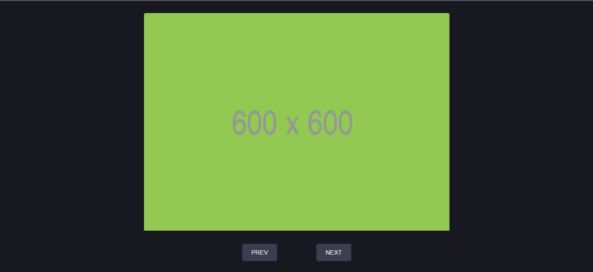

<div align="center" id="top"> 
  

&#xa0;

  <!-- <a href="https://carrossel.netlify.app">Demo</a> -->
</div>

<h1 align="center">Carrossel</h1>

<!-- <h4 align="center">
	🚧  Carrossel 🚀 Under construction...  🚧
</h4>

<hr> -->

<p align="center">
  <a href="">About</a> &#xa0; | &#xa0; 
  <a href=">Features</a> &#xa0; | &#xa0;
  <a href="#rocket-technologies">Technologies</a> &#xa0; | &#xa0;
  <a href="#white_check_mark-requirements">Requirements</a> &#xa0; | &#xa0;
  <a href="#checkered_flag-starting">Starting</a> &#xa0; | &#xa0;
  <a href="#memo-license">License</a> &#xa0; | &#xa0;
  <a href="https://github.com/oleandrosiq" target="_blank">Author</a>
</p>

<br>

## 🚀 About

Projeto desenvolvido para praticar meus conhecimentos nas linguagem - HTML - CSS - JAVASCRIPT

## 🚧 Features

&#xa0;

✅ Ir para a proxima imagem.\
✅ Ir para a imagem anterior.

&#xa0;

## 📜 Technologies

The following tools were used in this project:

- [Css](https://developer.mozilla.org/pt-BR/docs/Web/CSS)
- [Html](https://developer.mozilla.org/pt-BR/docs/Web/HTML)
- [Javascript](https://developer.mozilla.org/pt-BR/docs/Web/JavaScript)

## 🚀 Starting

```bash
# Clone this project
$ git clone https://github.com/oleandrosiq/carrossel

# Access
$ cd carrossel

# Install dependencies
$ yarn

# Run the project
$ yarn start

# The server will initialize in the <http://localhost:3000>
```

## 🎯 License

This project is under license from MIT. For more details, see the [LICENSE](LICENSE.md) file.

Made with ❤ by <a href="https://github.com/oleandrosiq" target="_blank">oleandrosiq</a>

&#xa0;

<a href="#top">Back to top</a>
